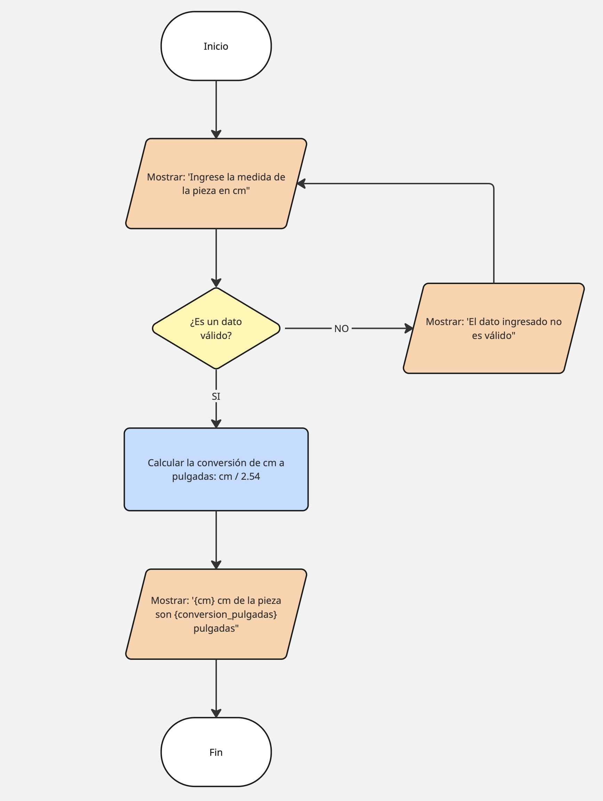

# conversion-medidas
Solución a problemática de empresa ficticia donde se realiza un programa de conversión de medida de centímetros a pulgadas.

## PROBLEMÁTICA
"La compañía estadounidense American MegaDesign está realizando un nuevo modelo de muebles basados en los planos del famoso diseñador industrial italiano Martin Vaccoto
pero muchas piezas no han encajado correctamente debido a que los planos están en cms y las maquinarias americanas en pulgadas"

## Diagrama de flujo
